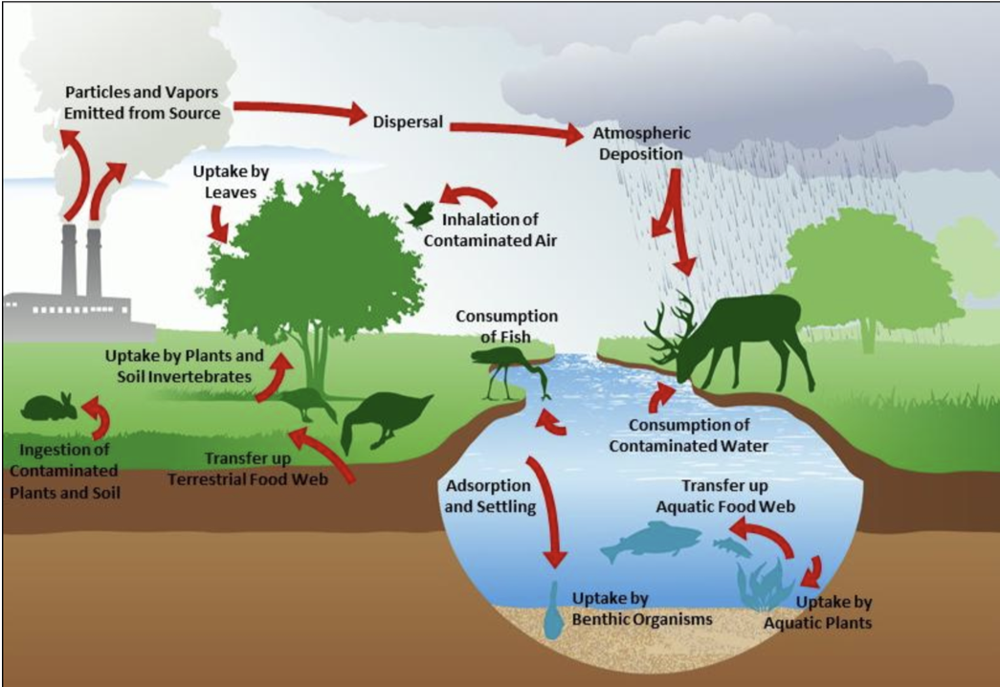
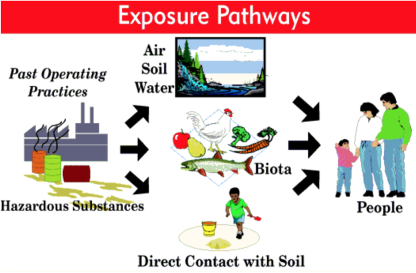
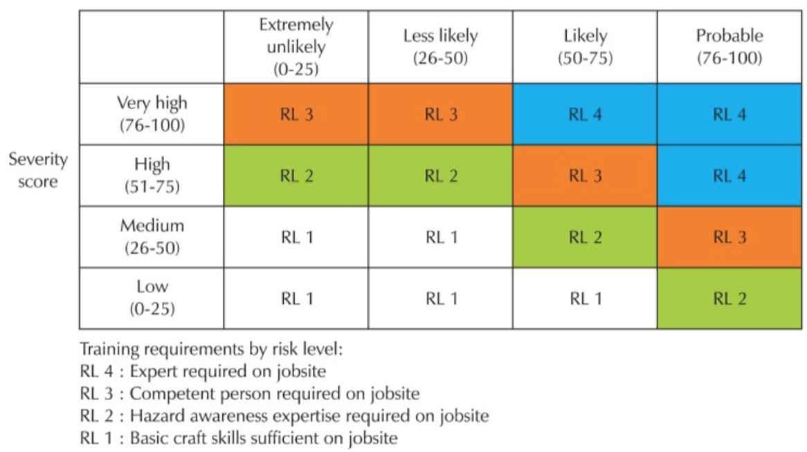

# Resource 3: Exposure Assessment

## Goal
To understand potential exposure scenarios. It is especially important to ensure that hazards are reduced when exposure is likely.

## Introduction

At each step of the product life cycle, who is most likely to be exposed? Consider intended uses of the product and likely unintended uses. Likely unintended use may include children mouthing on a cell phone case, spills of cleaning products, etc.

What are the most likely routes of exposure (dermal, inhalation a./or ingestion)? Develop a template that supports your consideration of alternatives.

What are the relative scale of exposure? How much of the chemical is present? How frequently will exposure occur? And for how long?

## Screening Exposure Assessment: Exposure Mapping
Consider the life cycle stages of the product to map out where potential exposures to hazardous chemicals might occur and who or what will be affected. For example, during production of agricultural feedstock, are workers likely to be exposed to pesticides? When a product is discarded, will it harm fish because aquatic toxicants have leached out? Include the likely routes of exposure (oral, dermal, ingestion, inhalation) in your map.

Consider the amount of the chemical that will be used, the frequency of exposure and the amount of time that exposure will occur.

Chemicals can travel through different environmental media and be taken up by humans primarily through inhalation, ingestion and through the skin.

Prepare a conceptual exposure model or map that illustrates the likely exposures that will occur across the life cycle of the product you are making. This is thought exercise that should result in what is sometimes called a ‘Measles chart’.

A measles chart such as the one illustrated below, is a structured, prepared form for collecting and analyzing data that provides a visual image of the item being evaluated so that data can be collected visually. It is called a measles chart because of the visual array of spots that may result.

[Qualitative approach to comparative exposure in alternatives assessment](http://setac.onlinelibrary.wiley.com/doi/full/10.1002/ieam.4070)

## Generalized Environmental Exposure Map

[More Exposure Assessment Resources from the U.S. EPA](http://www.epa.gov/expobox/exposure-assessment-tools-approaches-indirect-estimation-scenario-evaluation)

Considering exposure pathways to humans

[Image Source: ASTDR](http://www.atsdr.cdc.gov/sites/springvalley/newsletter_0202.html)

## Advanced Exposure Assessment
For some products, testing may be required to have verifiable information on the concentrations of chemicals in the product and whether or not the substances leach out of a product. This would be especially true for medical devices and presumably for food contact materials.

Other testing may also be recommended. Testing for impurities in recycled materials ensures that the supply of recycled materials result in the type of quality material that is needed.

Even more exposure assessment would include biomonitoring and environmental monitoring. These assessments measure how much of a chemicals is actually finding its way into bodies and into various parts of the environment.

A number of useful exposure models such as the Product Intake Fraction can also support informed decision making about chemicals and materials used in products.

[Learn more about Product Intake Fraction](http://pubs.acs.org/doi/abs/10.1021/acs.est.5b01083)

## Control Banding
Control banding is an assessment method that can be used to manage workplace risks. It is a process that matches, for example, a control measure (e.g., ventilation, engineering controls, containment, etc.) to a range or "band" of hazards (e.g., sk./eye irritation, very toxic, carcinogenic, etc.). The control banding method also groups chemicals according to similar physical or chemical characteristics, how the chemical will be handled or processed, and what the anticipated exposure is expected to be. The method then determines a set of controls chosen to help prevent harm to workers.

In general, bands represent:
- health hazards or risk (e.g., sk./eye irritation, carcinogenic, etc.),
- exposure potentials (e.g., quantity used, or characteristics of the products),
- control measures that should be taken to protect workers (e.g., types of ventilation, engineering controls, containment, etc.)

A control banding grid like the one below can be created to assess risk level. This helps indicate which hazards require the greatest control measures. The best form of occupational control for a very hazardous chemical is to eliminate it and replace it with a safer chemical or process. 

### Additional Resources on Control Banding 
[Source: Canadian Center for Occupational Health and Safety](http://www.ccohs.ca/oshanswers/chemicals/control_banding.html) 
[National Center for Biotechnology Information](http://www.ncbi.nlm.nih.gov/pmc/articles/PMC5146680/) 
[Image Source: Center for Disease Control and Prevention (CDC)](http://stacks.cdc.gov/view/cdc/10943)

PROSCALE is a new method for comparing hazard, exposure and risk from production and manufacturing processes used to make products. It considers chemical hazards associated with each unit process along with exposure routes, amounts, frequency and duration. Results from each unit process can be summed to reflect the entire production and manufacturing process. PROSCALE provides a score that allows for easy comparison between products. It does NOT address the inherent hazards of chemicals in product and exposure to those chemicals. It currently focuses exclusively on production and manufacturing. 

## Example
Floral Soil solutions recognized that florists don't wear personal protective equipment, and they are therefore exposed to hazardous chemicals while they work. Floral Soil solutions designed a product that doesn't contain those chemicals of concern, therefore eliminating florist exposure to them.

[Learn more about Floral Soil](http://www.floralsoilsolutions.com/)

## Tools for Assessing Exposure
* [Learn more about Decision Analysis on p.48](http:/theic2.org/article/download-pdf/file_name/IC2_AA_Guide_Version_1.1.pdf)

* [National Academies: Comparative Exposure Assessment](http://www.nap.edu/read/18872/chapter/8)
