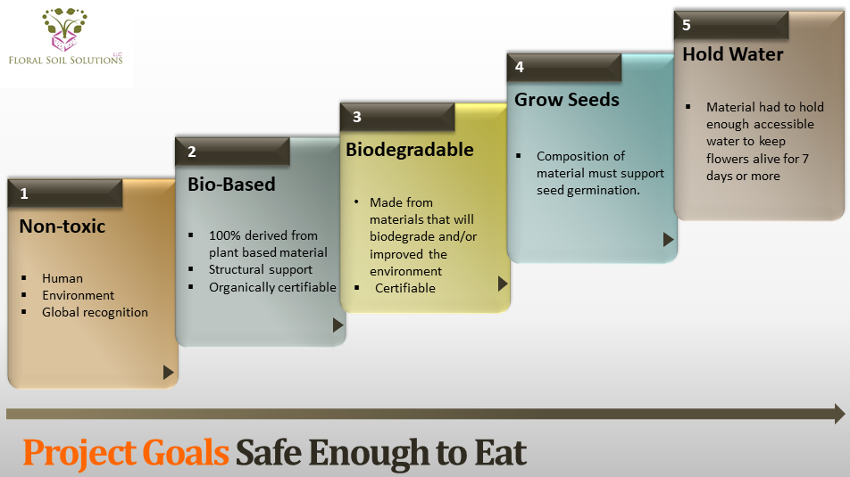

.. contents::
   :depth: 3
..

Step 1 Scoping and goals
========================

Goal:
-----

To help clarify your sustainable product design objectives. You will
consider:

1. Your product sustainability goals and priorities
2. The various life cycle stages of your product

Introduction
------------

The first step is to clarify the product concept and design
specifications and what your goals are for the product. Initial design
specifications determine which sustainability criteria are most relevant
to assess.

Example: Floral Soil
--------------------

A product concept with exceptional ambitions for sustainable product
design is `Floral Soil <http://www.floralsoilsolutions.com/>`__. Floral
Soil is designed to replace conventional floral foam used by florists to
hold flowers in place in an arrangement and to keep them moist. The
designer set out to create a product that was ‘safe enough to eat’ in
addition to being biobased, biodegradable in home gardens or compost,
reusable and high performing with respect to holding water to replace
current floral foams.

Floral Soil design goals includes: 1) Non-toxic 2) Bio-based 3)
Biodegradable 4) Grow seeds 5) Hold water

   Floral Soil design goals

`Learn more about Floral Soil
Solutions. <http://www.floralsoilsolutions.com/>`__
