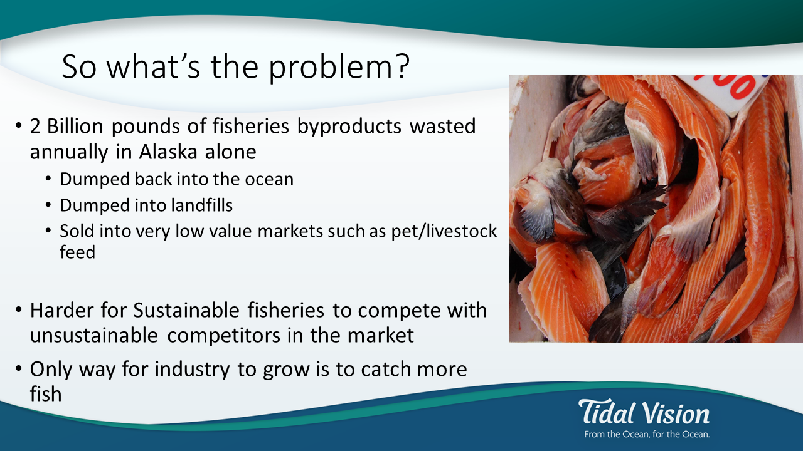
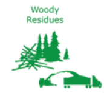
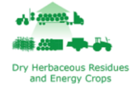

.. contents::
   :depth: 3
..

Step 2 Feedstock
================

Goal:
-----

To use base feedstock that preserves ./or restores natural capital while
providing performance and other sustainability benefits.

Introduction to Feedstock Concerns
----------------------------------

According to the `World Forum on Natural
Capital <http://naturalcapitalforum.com/about/>`__, natural capital is
defined as the world’s stocks of natural assets that include geology,
soil, air, water and all living things. Humans depend on natural capital
for a wide range of ecosystem services. Poorly managed natural capital
can destroy productivity and resilience, making it more difficult for
humans and other species to sustain themselves
(`6 <https://naturalcapitalforum.com/about/>`__). To meet the design
principle of Maximizing Resource Efficiency, it is necessary to preserve
natural capital. The choice of feedstock can have significant impacts on
natural capital.

Best practices strive to decouple feedstock selection from negative
impacts on natural capital such as natural resource depletion and
negative impacts on communities from raw material extraction. Some
feedstock is not renewable but it may be abundant.

Other feedstock such as certain metals may be rare and metals are of
course not renewable. The use of renewable feedstock will not be
sustainable if degradation or consumption of it occurs at a rate that is
faster than the resource can regenerate. If a depleting feedstock is
used, then care should be taken to ensure that the materials will be
recycled once no longer needed.

Products based on depleting natural resources or renewable resources
that degrade land or compete with food production do not preserve
natural capital and do not support sustainable product design. Feedstock
derived from easily recycled materials, readily available wastes such as
agricultural wastes or rapidly renewable and abundant biomass like algae
or seaweed may help to preserve natural capital. For some renewable raw
materi./feedstock, certification programs are available to ensure that
the resources are responsibly managed for environmental, social and
economic benefits.

At a minimum, define the primary feedstock used to generate the
chemical, material or product. In general, rapidly renewable or waste
derived feedstock results in supply chain benefits. Evaluations can be
enhanced by ‘designing with the end in mind’. Think about whether or not
there is a relationship between feedstock and waste management options.
Can they be linked to create both supply and demand for materials that
cycle in a sustainably managed material economy.

Example
-------

Examples of renewable feedstocks
~~~~~~~~~~~~~~~~~~~~~~~~~~~~~~~~

|Round wood and energy crops| |Woody residues| |Dry herbaceous residues
and energy crops| |Wet herbaceous residues and energy crops| |Municipal
solid wastes|

`Image source: Department of
Energy <http://www.energy.gov/eere/bioenergy/biomass-feedstocks/>`__

TidalVision USA uses waste from sustainable fisheries
~~~~~~~~~~~~~~~~~~~~~~~~~~~~~~~~~~~~~~~~~~~~~~~~~~~~~

`TidalVision USA <http://tidalvisionusa.com/>`__ is an early stage
company based in Bellingham, WA that uses fishery wastes to make high
value products. They refer to this as ‘upcycling’ because a low value
waste material is used to make a high value product. Their goal is to
add value to the sustainable fishing and crabbing industries by
generating value from the waste. The company treats salmon skins to make
salmon leather using benign chemical process and makes wallets, purses,
and other high value products. They also process crab waste to make a
variety of useful products based on chitosan that is derived from the
chitin in the shell wastes. The founder of the company is an Alaskan
fisherman who was disturbed by the scale of fisheries byproduct wastes
and became a social and environmental entrepreneur. He uses wastes from
sustainable fisheries to add value to an industry that strives to
operate sustainably.

   two billion pounds Alaskan fisheries byproducts wasted annually

   wallets made from salmon skin

.. |Municipal solid wastes| image:: ./assets/2-feedstock/municipal-solid-wastes.png
